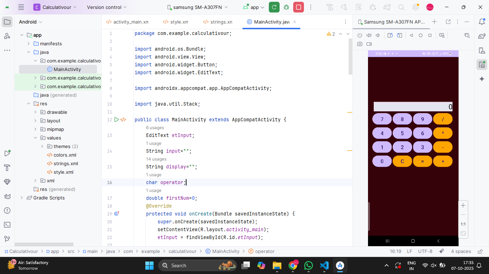
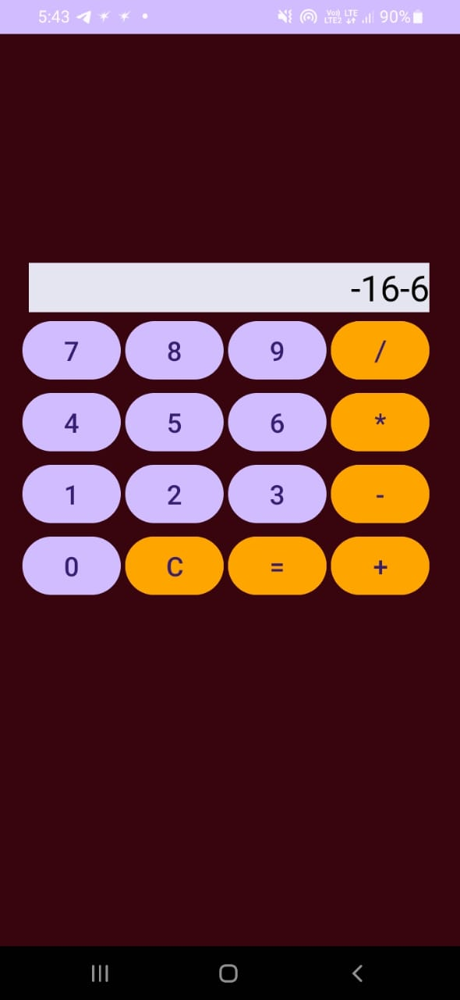

# Ex.No:5 Develop a program to create a simple calculator using Android Studio.


## AIM:

To develop a program to create a simple calculator using Android Studio.

## EQUIPMENTS REQUIRED:

Android Studio(Latest Version)

## ALGORITHM:

Step 1: Open Android Stdio and then click on File -> New -> New project.

Step 2: Then type the Application name as `Calculativour` and click Next. 

Step 3: Then select the Minimum SDK as shown below and click Next.

Step 4: Then select the Empty Activity and click Next. Finally click Finish.

Step 5: Design layout in activity_main.xml.

Step 6: Get contacts details and Display details give in MainActivity file.

Step 7: Save and run the application.

## PROGRAM:
```
/*
Program to print the contact name and phone number using content providers.
Developed by : VISHWARAJ G. 
Registeration Number : 212223220125
*/

package com.example.calculativour;

import android.os.Bundle;
import android.view.View;
import android.widget.Button;
import android.widget.EditText;

import androidx.appcompat.app.AppCompatActivity;

import java.util.Stack;

public class MainActivity extends AppCompatActivity {
    EditText etInput;
    String input="";
    String display="";
    char operator;
    double firstNum=0;
    @Override
    protected void onCreate(Bundle savedInstanceState) {
        super.onCreate(savedInstanceState);
        setContentView(R.layout.activity_main);
        etInput = findViewById(R.id.etInput);

        int[] numberIds = {R.id.btn0,R.id.btn1,R.id.btn2,R.id.btn3,R.id.btn4,R.id.btn5,R.id.btn6,R.id.btn7,R.id.btn8,R.id.btn9};

        for (int id:numberIds){
            findViewById(id).setOnClickListener(this::onNumberClick);
        }

        findViewById(R.id.btnAdd).setOnClickListener(this::onSymbolClick);
        findViewById(R.id.btnDiv).setOnClickListener(this::onSymbolClick);
        findViewById(R.id.btnMul).setOnClickListener(this::onSymbolClick);
        findViewById(R.id.btnSub).setOnClickListener(this::onSymbolClick);

        findViewById(R.id.btnEq).setOnClickListener(v->calculate());
        findViewById(R.id.btnC).setOnClickListener(v->close());
    }
    private void calculate() {
        if (display.isEmpty()) return;

        try {
            double result = evaluateExpression(display);
            display = removeTrailingZero(result);
            etInput.setText(display);
        } catch (Exception e) {
            etInput.setText("Error");
            display = "";
        }
    }
    private void onNumberClick(View v){
        Button btn = (Button)v;
        display += btn.getText().toString();
        etInput.setText(display);
    }
    private void onSymbolClick(View v){
        Button btn = (Button)v;
        String op = btn.getText().toString();

        if (!display.isEmpty() && !isLastCharOperator()) {
            display += op;
            etInput.setText(display);
        }
    }
    private boolean isLastCharOperator(){
        if(display.isEmpty()) return false;
        char last = display.charAt(display.length() - 1);
        return last == '+' || last == '-' || last == '*' || last == '/';
    }
    private String removeTrailingZero(double value) {
        if (value == (long) value)
            return String.format("%d", (long) value);
        else
            return String.format("%s", value);
    }
    private int precedence(char op) {
        if (op == '+' || op == '-') return 1;
        if (op == '*' || op == '/') return 2;
        return 0;
    }

    private double applyOp(double a, double b, char op) {
        switch (op) {
            case '+': return a + b;
            case '-': return a - b;
            case '*': return a * b;
            case '/': return b != 0 ? a / b : 0;
        }
        return 0;
    }
    private double evaluateExpression(String expr) {
        Stack<Double> numbers = new Stack<>();
        Stack<Character> ops = new Stack<>();

        for (int i = 0; i < expr.length(); i++) {
            char c = expr.charAt(i);

            if (Character.isDigit(c) || c == '.') {
                StringBuilder sb = new StringBuilder();
                while (i < expr.length() && (Character.isDigit(expr.charAt(i)) || expr.charAt(i) == '.')) {
                    sb.append(expr.charAt(i));
                    i++;
                }
                i--; // adjust for loop increment
                numbers.push(Double.parseDouble(sb.toString()));
            } else if (c == '+' || c == '-' || c == '*' || c == '/') {
                while (!ops.isEmpty() && precedence(ops.peek()) >= precedence(c)) {
                    double b = numbers.pop();
                    double a = numbers.pop();
                    char op = ops.pop();
                    numbers.push(applyOp(a, b, op));
                }
                ops.push(c);
            }
        }

        while (!ops.isEmpty()) {
            double b = numbers.pop();
            double a = numbers.pop();
            char op = ops.pop();
            numbers.push(applyOp(a, b, op));
        }

        return numbers.pop();
    }
    private void close(){
        input = "";
        firstNum = 0;
        operator = '\0';
        display="";
        etInput.setText("");
    }
}
```

## OUTPUT

#### Coding Part


#### Design Part


#### App Image


## RESULT
Thus a Simple Calculator Application using Android Studio is developed and executed successfully.
